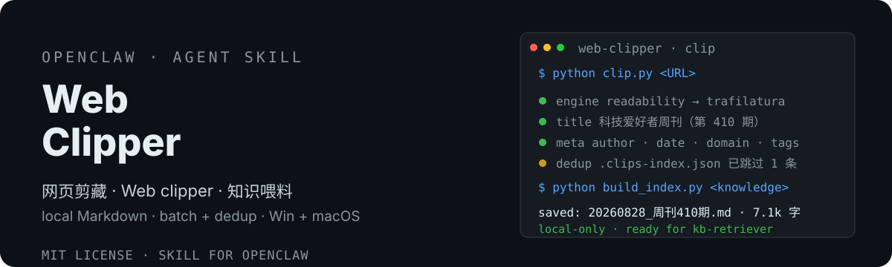

# OpenClaw Web Clipper 📎

<div align="center">
  <strong>Web clipping — knowledge feeder</strong> | <a href="README.md">中文</a>
</div>

<p align="center">
  
</p>

> Save any web page as clean local Markdown with YAML frontmatter. Dual-engine extraction (readability-lxml + trafilatura fallback), Chinese-safe filenames, batch clipping with dedup, output ready for kb-retriever indexing.
> 网页「知识喂料机」：发送链接 → 提取正文 → 保存本地 Markdown（frontmatter 齐全）→ 直通 knowledge/ 建索引可检索。双引擎提取、中文友好、批量去重。


[](https://clawhub.ai/dtsola/skills/xiaoyaoclaw-web-clipper)

## Why you need it

You find a great article and want to keep it, but:
- 🔖 Browser bookmarks pile up and **you never open them again**
- 📝 Copy-pasting into notes gives **broken formatting**, no source, no date
- 🌐 Cloud clippers (Evernote/Cubox) **hold your data hostage** — paid, leaky
- 🧠 You want to feed your AI knowledge base, but **formats are inconsistent and unsearchable**

This skill fixes it: **one command, web page → clean local Markdown**, with title/source/author/date frontmatter, straight into `knowledge/` for indexing — your AI can search it anytime.

## Features

- 🔧 **Dual-engine extraction**: readability-lxml (fast) + trafilatura (academic-grade) automatic fallback chain — quality score decides, bs4 as last resort
- 🇨🇳 **Chinese-friendly**: WeChat MP / Zhihu / CSDN container adapters, GBK/UTF-8 auto-detection, **Chinese titles kept safe in filenames**
- 📋 **Batch clipping**: URL list file in one pass, summary report (ok/skip/fail)
- 🔁 **Auto-dedup**: `.clips-index.json` index — duplicate URLs skipped automatically
- 📦 **Full frontmatter**: title/source/author/date/tags, Obsidian-compatible
- 🔗 **Knowledge-base loop**: outputs to `knowledge/clippings/` by default; one command with kb-retriever rebuilds the index and it's searchable
- 🖥️ **Cross-platform**: identical behavior on Windows & macOS (pure Python)
- 🔒 **Local-only**: no external APIs, data never leaves your machine

## Install

```bash
# ClawHub (recommended)
clawhub install xiaoyaoclaw-web-clipper

# Or manually from GitHub
git clone https://github.com/dtsola/xiaoyaoclaw-web-clipper
# Put SKILL.md and scripts/ into your skills directory
```

Dependencies: `requests` `beautifulsoup4` `lxml` (optional enhancers: `readability-lxml` `trafilatura`)

```bash
pip install requests beautifulsoup4 lxml
# Optional (better extraction quality):
pip install readability-lxml trafilatura
```

## Usage

1. Put the skill into your OpenClaw skills directory
2. Tell your agent: **"clip this https://..."** / "save this article"
3. The agent extracts the content, saves the Markdown and tells you the path

Or run the script directly:

```bash
# Single clip (defaults to ~/knowledge/clippings/)
python scripts/clip.py <URL>

# Custom dir + tags
python scripts/clip.py <URL> --dir ~/knowledge/clippings --tags ai,research

# Batch clip (one URL per line, # comments)
python scripts/clip.py --batch urls.txt

# Check dependencies
python scripts/clip.py --check
```

## 🚀 Quick start (3 steps, 5 minutes)

### Step 1: Install skill + dependencies

```bash
clawhub install xiaoyaoclaw-web-clipper
pip install requests beautifulsoup4 lxml readability-lxml trafilatura
```

### Step 2: Clip an article

Tell your agent: **"clip https://example.com/article"**

Seconds later: `✅ Saved to knowledge/clippings/20260828_Article Title.md`

### Step 3: Index & search (with kb-retriever)

Once you have clips, rebuild the knowledge-base index:

```bash
python <kb-retriever>/scripts/build_index.py <knowledge-root>
```

Then ask your agent "search the knowledge base for X" — your clips are findable.

### Daily habits

| Scenario | How |
|---|---|
| Save one article | "clip <URL>" |
| Batch collect | list URLs in a txt, `--batch urls.txt` |
| Categorize | `--dir knowledge/clippings/<topic>` + `--tags` |
| Index & search | run kb-retriever's `build_index.py` periodically |
| Workspace health | auditor checks whether clippings are indexed |

## Comparison

| | Browser bookmarks | Cloud clippers (Evernote/Cubox) | **xiaoyaoclaw-web-clipper** |
|---|---|---|---|
| Format | none, just links | proprietary | ✅ standard Markdown + frontmatter |
| Data ownership | browser | cloud (paid/privacy) | ✅ local files, fully local |
| Search | none | site search | ✅ knowledge base, AI-searchable |
| Automation | manual | manual | ✅ one agent command, batch + dedup |
| Cost | free | subscription | ✅ free, Python only |

## Directory structure

```
xiaoyaoclaw-web-clipper/
├── SKILL.md                    # Skill body (triggers / workflow / red lines)
├── scripts/
│   ├── clip.py                 # 【Core】entry: single URL / batch / dedup / frontmatter
│   └── extract.py              # 【Core】dual-engine extraction (readability + trafilatura fallback)
├── assets/readme/
│   ├── hero.svg                # README cover
│   └── community-qr.png        # community QR
├── docs/
│   └── DESIGN.md               # design doc (engine fallback chain / metadata rules / test log)
├── README.md / README.en.md
└── LICENSE
```

## License

MIT — use it freely, attribution optional.

---

## 🛠️ Customization?

**Agent & Skills customization, from ¥800.**

- WeChat: `dtsola` (note: **openclaw定制**)
- Services: OpenClaw multi-agent deployment / workspace standardization / custom Skill development / agent memory systems / knowledge-base setup

## Sibling projects (Six-piece suite)

- 🏠 **xiaoyaoclaw-workspace-initializer**: a "home" for every agent — standard directory structure + WORKSPACE.md rules + multi-agent config safety. <https://github.com/dtsola/xiaoyaoclaw-workspace-initializer>
- 🧠 **xiaoyaoclaw-memory-distill**: distill conversations into MEMORY.md + daily logs, fixes context overflow. <https://github.com/dtsola/xiaoyaoclaw-memory-distill>
- 🗂️ **xiaoyaoclaw-task-progress-tracker**: directory-as-container, PROGRESS.md-as-progress — tasks/ & projects/ lifecycle management. <https://github.com/dtsola/xiaoyaoclaw-task-progress-tracker>
- 📚 **xiaoyaoclaw-kb-retriever**: local knowledge-base retrieval — layered data_structure.md index + progressive retrieval (md/pdf/xlsx), no API key, Windows/macOS. <https://github.com/dtsola/xiaoyaoclaw-kb-retriever>
- 🩺 **xiaoyaoclaw-workspace-auditor**: read-only health check — directory compliance, task progress, memory logs, knowledge-base index, junk files; graded report + fix suggestions. <https://github.com/dtsola/xiaoyaoclaw-workspace-auditor>

## 小遥Claw / XiaoyaoClaw

**XiaoyaoClaw — put an AI assistant on your own computer.**

- 🚀 Landing page: <https://www.yuque.com/dtsola/igp1aa/adcicbai2zlem0bz>
- 📖 Intro: <https://github.com/dtsola/xiaoyaoclaw-introduction>

## About the author

- 🌐 Blog: <https://www.dtsola.com>
- 📺 Bilibili: <https://space.bilibili.com/736015>
- 💻 GitHub: <https://github.com/dtsola>
- 📕 Xiaohongshu: <https://www.xiaohongshu.com/user/profile/5b4c0597e8ac2b06aa13346d>

## 💬 Join the community

Xiaoyao product family user group — feedback · exchange · suggestions:

<p align="center">
  
</p>

<p align="center">Scan to join, or add WeChat <code>dtsola</code> (note: <b>加群</b>)</p>
